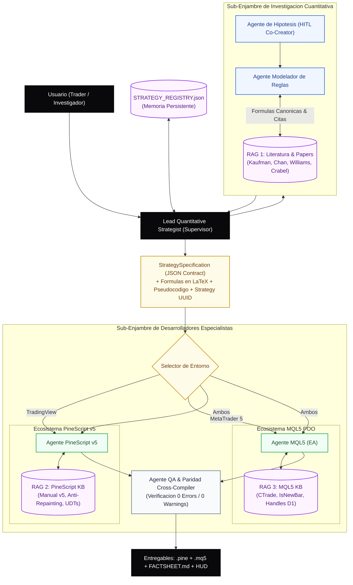

# Arquitectura del Sistema Multi-Agente (Quant Agentic Swarm)

Este documento detalla la topologia agentica, los contratos de datos, el flujo de estados y los mecanismos de sincronizacion tecnica que gobiernan el **Quant Agentic Swarm (QAS)**.

---

## 1. Topologia del Enjambre: Jerarquia con Supervisor y RAGs Federados

El sistema implementa una **topologia jerarquica con enjambres especializados** (Supervisor / Sub-swarms) para evitar la dispersion cognitiva y la contaminacion de contexto:



---

## 2. Especializacion de Roles y Agentes

| Agente | Enjambre | Responsabilidad Principal | Tools / Dependencias |
| :--- | :--- | :--- | :--- |
| **`Lead Strategist`** | Supervision | Orquesta el ciclo completo, valida el `Strategy UUID` y administra `STRATEGY_REGISTRY.json`. | Vector Memory, File I/O |
| **`HypothesisAgent`** | Investigacion | Descompone ideas en 3 Fichas Tecnicas (Variantes A, B, C) y gestiona la puerta HITL. | HITL Gatekeeper, Prompt Socratico |
| **`RuleModelerAgent`** | Investigacion | Traduce la hipotesis en condiciones matematicas, el Z-Score de volatilidad MTF y las 3 barreras (con TP anclado a ATR D1). | RAG 1 (Libros de Trading), Motor LaTeX |
| **`PineScriptAgent`** | Desarrollo | Escribe codigo nativo Pine Script v5 idiomatico, con tipos explicitos y `lookahead_off`. | RAG 2 (PineScript v5 Reference) |
| **`MQL5Agent`** | Desarrollo | Diseña Expert Advisors estructurados en POO con la libreria estandar `Trade\Trade.mqh`. | RAG 3 (MQL5 Standard Library) |
| **`QACodeAgent`** | Control Calidad | Audita que no existan discrepancias logicas entre PineScript y MQL5 y valida compilacion. | Cross-Compiler Linter |

---

## 3. Contrato de Comunicacion Intermedia: `StrategySpecification`

Los desarrolladores **NUNCA** reciben texto informal o ambiguo. Reciben un contrato estructurado en formato JSON validado por JSON Schema:

```json
{
  "$schema": "../schemas/strategy_specification.schema.json",
  "strategy_id": "STRAT-20260901-ORB_D1Z-M15-v1.0",
  "timestamp": "2026-09-01T11:00:00Z",
  "hypothesis": {
    "condition_x": "Ruptura del maximo asiatico en vela cerrada M15",
    "expected_outcome_y": "Expansion direccional sostenida en la apertura de Londres",
    "structural_reason_z": "Absorcion institucional de liquidez y ejecucion de ordenes pendientes",
    "invalidation_criterion": "Cierre de vela M15 por debajo del nivel de ruptura"
  },
  "market_regime_mtf": {
    "model": "Lopez_de_Prado_Daily_ZScore",
    "regime_timeframe": "D1",
    "execution_timeframe": "M15",
    "fast_atr_period": 5,
    "slow_atr_period": 14,
    "zscore_threshold_high": 0.67,
    "target_history_years_range": [5, 10]
  },
  "execution_rules": {
    "entry_long": {
      "trigger_formula_latex": "\\text{Close}_{M15} > \\text{High}_{\\text{Asian}}",
      "pseudocode": "IF Close > Asian_High AND z_vol > 0.67 AND InSession() THEN BuySignal = TRUE",
      "canonical_citation": "Toby Crabel - Day Trading with Short Term Price Patterns"
    },
    "triple_barrier_exits": {
      "barrier_1_profit_atr_d1_multiplier": 1.0,
      "barrier_2_stop_atr_multiplier": 1.5,
      "barrier_3_time_stop_max_bars": 24
    }
  },
  "research_purity_declaration": {
    "live_execution_filters_omitted": true,
    "unrequested_passive_protections": false
  }
}
```

---

## 4. Sincronizacion del Modelo de Ejecucion (TV vs MT5)

Para garantizar paridad total entre TradingView y MetaTrader 5:

1. **Sincronizacion Multi-Timeframe (D1 -> M15):**
   * **PineScript:** `request.security(syminfo.tickerid, "D", ta.atr(14)[1], barmerge.gaps_off, barmerge.lookahead_off)` (usa la barra cerrada de ayer `[1]` tanto para el Z-Score como para el Take Profit de $k_1 \times \text{ATR}_D(14)$ para evitar repainting).
   * **MQL5:** `CopyBuffer(handle_atr14_d1, 0, 1, 20, buffer)` (copia desde el `shift = 1` del grafico diario).
2. **Granularidad Temporal (`IsNewBar`):**
   * En PineScript las estrategias evaluan por defecto al cierre de barra (`barstate.isconfirmed`).
   * En MQL5, el agente incluye una clase de utilidad `IsNewBar()` dentro de `OnTick()` para que el EA solo dispare cuando la vela intradia se haya confirmado, eliminando falsos positivos intra-barra.
3. **Telemetria Homogenea:**
   * Ambos lenguajes emiten logs en formato JSON estructurado unicamente en momentos de disparo (`ENTRY` / `EXIT`).
